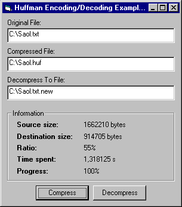



## Huffman Compression/Decompression

### Description

This is a Compression/Decompression routine using Huffman Encoding/Decoding, and works best on normal text files.

The code is *highly* optimized, and to show how fast this is I can mention another code sample found here on planetsourcecode (from August 1st 2000) which also uses Huffman Encoding. That code took 127 seconds to compress a 1.8mb textfile, but with my code this takes less than 1 second!! (that's an approvement of 12700%!!). That other code was worth 7 excellent points, how many is this worth? ;)
 
### More Info
 

             |
---                |---
**Submitted On**   |2000-11-13 15:32:24
**By**             |[Fredrik Qvarfort](https://github.com/Planet-Source-Code/PSCIndex/blob/master/ByAuthor/fredrik-qvarfort.md)
**Level**          |Intermediate
**User Rating**    |5.0 (302 globes from 61 users)
**Compatibility**  |VB 5\.0, VB 6\.0
**Category**       |[Miscellaneous](https://github.com/Planet-Source-Code/PSCIndex/blob/master/ByCategory/miscellaneous__1-1.md)
**World**          |[Visual Basic](https://github.com/Planet-Source-Code/PSCIndex/blob/master/ByWorld/visual-basic.md)
**Archive File**   |[CODE\_UPLOAD1164011132000\.zip](https://github.com/Planet-Source-Code/fredrik-qvarfort-huffman-compression-decompression__1-11000/archive/master.zip)

